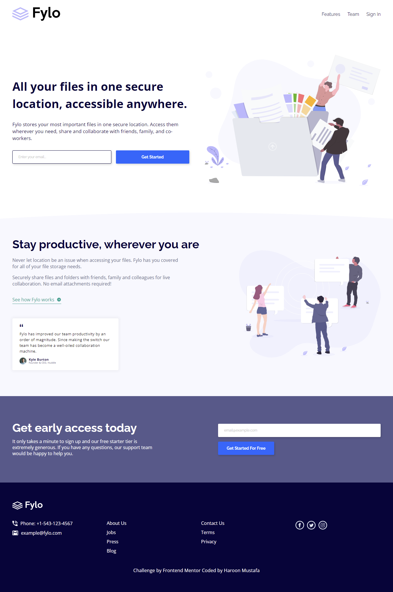

# Frontend Mentor - QR code component solution

This is a solution to the [Fylo landing page challenge on Frontend Mentor](https://www.frontendmentor.io/challenges/fylo-landing-page-with-two-column-layout-5ca5ef041e82137ec91a50f5). Frontend Mentor challenges help you improve your coding skills by building realistic projects.

## Table of contents

- [Overview](#overview)
  - [Screenshot](#screenshot)
  - [Links](#links)
- [My process](#my-process)
  - [Built with](#built-with)
- [Author](#author)

## Overview

### Screenshot

### Links

- Solution URL: [https://github.com/haroon-raja/fylo-landing-page](https://github.com/haroon-raja/fylo-landing-page)
- Live Site URL: [https://haroon-raja.github.io/fylo-landing-page/](https://haroon-raja.github.io/fylo-landing-page/)

## My process

### Built with

- Semantic HTML5 markup
- CSS custom properties
- SCSS
- CSS Grid
- CSS Flexbox
- Mobile-First Workflow

### Continued development

In future projects I would like to focus on Mobile-first workflow. And want to become more comfertable when writing media queries

## Author

- Frontend Mentor - [@haroon-raja](https://www.frontendmentor.io/profile/haroon-raja)
